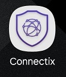
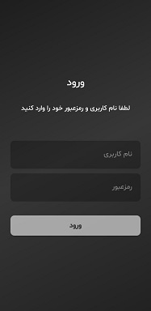
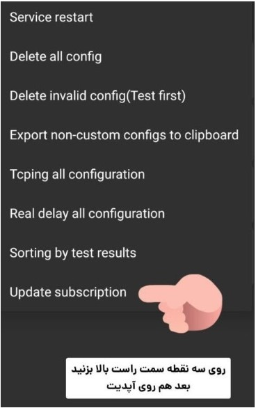
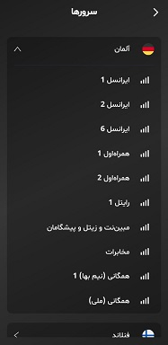
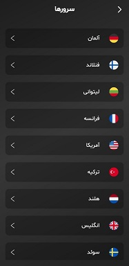
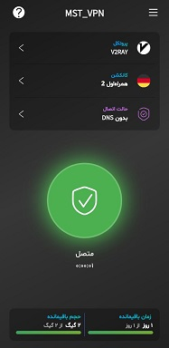

<html lang="fa">
<head>
    <meta charset="UTF-8">
    <meta name="viewport" content="width=device-width, initial-scale=1.0">
    <title>وب‌سایت موبایل مصطفی</title>
    
</head>
<body>

 <!  FixGsm    -->
    کلیه خدمات تلفن همراه - 09354811944

<!-- سایر محتوای صفحه شما اینجا قرار می‌گیرد -->

</body>
</html>

---

<left> 
        

          
        

       
</left>

🟣 [**Android -دانلود برنامه آندروید**](https://apps.irancdn.org/android/connectix-2.5.2-univ.apk) - [backup](https://drive.google.com/file/d/1M2rQ3EVxl1rZN1MALqthGV9U9tj_svls/view?usp=sharing)

🟣 [**IOS دانلود از اپل استور**](https://testflight.apple.com/join/FQkEGDfX "مخصوص گوشیهای آیفون")  _ [🎥](https://drive.google.com/file/d/1ZNYhNTZCxctBvze1bEsSok4ujWjHx756/view?usp=drive_web "فیلم نصب روی آیفون") 

🟣 [**Windows**](https://apps.irancdn.org/windows/connectix-2.5.2-win.zip "مخصوص ویندوز ")

---
لطفا نکات زیر رو مطالعه بفرمائید

همیشه برنامه رو بروزرسانی کنید

 دقت کنید از قسمت کانکشن نوع  کانکشنی که انتخاب میکنین با نوع اینترنت گوشیتون مطابق باشه مثلا اگر اینترنت ایرانسل دارین کانکشن ایرانسل و به همین ترتیب

 روزی یک بار در صفحه لیست کانکشن ها مطابق عکس زیر دکمه بروزرسانی روبزنین بعد از بروزرسانی پایین صفحه یک پیام سبز رنگ موفقیت آمیز بودن نمایش داده می‌شود

---
[در آندروید Ipv6 فعالسازی](https://www.aparat.com/v/ndu013x)

[در گوشیهای اپل Ipv6 فعالسازی](https://vpnhelp.github.io/fa/docs/ipv6-apple) 

---

<h1>

 
 خرید اکانت از ربات تلگرام ما

</h1>

✅ [**Telegram ربات**](https://t.me/mst_vpn_bot)

---
برای اطلاع از آخرین تغییرات در کانال تلگرام ما عضو شوید

✅ [**Telegram کانال**](https://t.me/+QDqHzG8cLuQ1Y2E8)

__________________________________________

> Contact Us → [Telegram](http://t.me/fastfixgsm) _ [gfix4600@gmail.com](mailto:gfix4600@gmail.com)       
